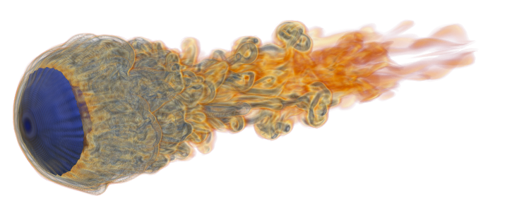
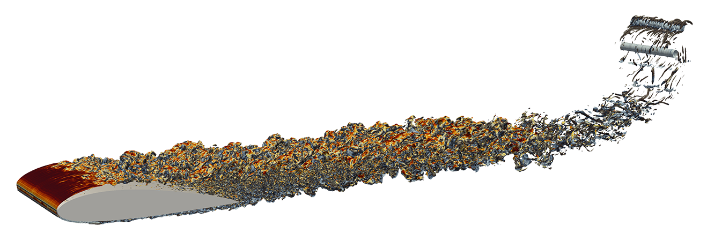
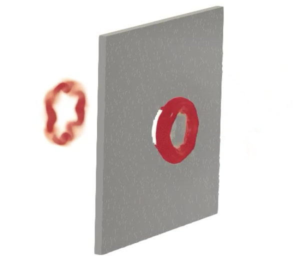
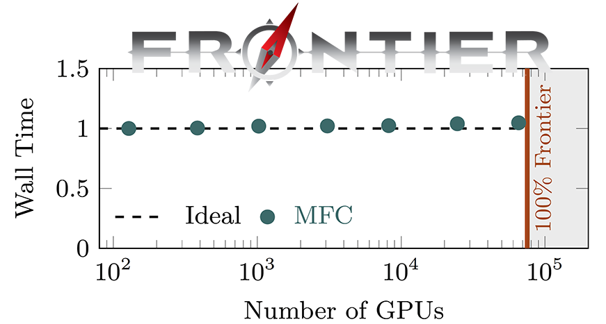

<p align="center">
  <a href="http://mflowcode.github.io/">
    
  </a>
</p>

<p align="center">
  <a href="http://dx.doi.org/10.1016/j.cpc.2020.107396" target="_blank">
    
  </a>
  <a href="https://github.com/MFlowCode/MFC/actions">
    
  </a>
  <a href="https://join.slack.com/t/mflowcode/shared_invite/zt-y75wibvk-g~zztjknjYkK1hFgCuJxVw">
    
  </a>
  <a href="https://lbesson.mit-license.org/">
    
  </a>
  <a href="https://codecov.io/github/MFlowCode/MFC" target="_blank">
    
  </a>
</p>

Welcome to the home of MFC!
MFC simulates compressible multi-component and multi-phase flows, [amongst other things](#what-else-can-this-thing-do). 
MFC is written in Fortran and uses metaprogramming to keep the code short (about 20K lines).

MFC is used on the latest leadership-class supercomputers.
It scales <b>ideally to exascale</b>; [tens of thousands of GPUs on NVIDIA- and AMD-GPU machines](#is-this-really-exascale) on Oak Ridge Summit and Frontier.
MFC is a SPEChpc benchmark candidate, part of the JSC JUPITER Early Access Program, and used OLCF Frontier and LLNL El Capitan early access systems.
  
Get in touch with <a href="mailto:shb@gatech.edu">Spencer</a> if you have questions!
We have an [active Slack channel](https://join.slack.com/t/mflowcode/shared_invite/zt-y75wibvk-g~zztjknjYkK1hFgCuJxVw) and development team.
MFC has high- and low-level documentation, visualizations, and more on [its website](https://mflowcode.github.io/).

## An example

We keep many examples.
Here are some of them!
MFC can execute high-fidelity simulations of shock-droplet interaction (see `examples/3d_shockdroplet`)

<p align="center">
    
</p>

This one simulates high-Mach flow over an airfoil:

<p align="center">
    <br/>
</p>

And here is a high amplitude acoustic wave reflecting and emerging through a circular orifice:

<p align="center">
    <br/>
</p>


## Getting started

You can navigate [to this webpage](https://mflowcode.github.io/documentation/md_getting-started.html) to get started using MFC!
It's rather straightforward.
We'll give a brief intro. here for MacOS.
Using [brew](https://brew.sh), install MFC's dependencies:
```shell
brew install coreutils python cmake fftw hdf5 gcc boost open-mpi
```
You're now ready to build and test MFC!
Put it to a convenient directory via
```shell
git clone https://github.com/MFlowCode/MFC
cd MFC
```
and be sure MFC knows where to find Boost by appending to your dotfiles and sourcing them again
```shell
echo -e "export BOOST_INCLUDE='$(brew --prefix --installed boost)/include'" | tee -a ~/.bash_profile ~/.zshrc
. ~/.bash_profile 2>/dev/null || . ~/.zshrc 2>/dev/null
! [ -z "${BOOST_INCLUDE+x}" ] && echo 'Environment is ready!' || echo 'Error: $BOOST_INCLUDE is unset. Please adjust the previous commands to fit with your environment.'
```
then you can build MFC and run the test suite!
```shell
./mfc.sh build -j $(nproc)
./mfc.sh test -j $(nproc)
```
And... you're done!

You can learn more about MFC's capabilities [via its documentation](https://mflowcode.github.io/documentation/index.html) or play with the examples located in the `examples/` directory (some are [shown here](https://mflowcode.github.io/documentation/md_examples.html))!

The shock-droplet interaction case above was run via
```shell
./mfc.sh run -n $(nproc) ./examples/3d_shockdroplet/case.py 
```
where `$(nproc)` is the number of cores the example will run on (and the number of physical cores on your CPU device).
You can visualize the output data in `examples/3d_shockdroplet/silo_hdf5` via Paraview, Visit, or your favorite software.

## Is this _really_ exascale?

[OLCF Frontier](https://www.olcf.ornl.gov/frontier/) is the first exascale supercomputer.
The weak scaling of MFC on this machine shows near-ideal utilization. 

<p align="center">
    
</p>


## What else can this thing do

MFC has many features.
They are organized below.

### Physics

* 1-3D
* Compressible
	* Low Mach number treatment available
* Multi- and single-component
	* 4, 5, and 6 equation models for multi-component/phase features
   	* Kapila and Allaire models 5-equation models
* Multi- and single-phase 
	* Phase change via p, pT, and pTg schemes
* Grids
	* 1-3D Cartesian, cylindrical, axisymmetric. 
	* Arbitrary grid stretching for multiple domain regions.
	* Complex/arbitrary geometries via immersed boundary method
	* STL geometry files supported
* Surface tension for multiphase cases
* Sub-grid dynamics
	* Euler-Euler particle models for bubble dynamics and similar
	* Euler-Lagrange bubble dynamics
* Viscous effects (high-order accurate representations)
* Ideal and stiffened gas equations of state
* Body forces
* Acoustic wave generation (one- and two-way sound sources)
</details>

### Numerics

* Shock and interface capturing schemes
	* First-order upwinding
 	* WENO reconstructions of order 3, 5, and 7
  	* WENO variants: WENO-JS, WENO-M, WENO-Z, TENO
   	* Monotonicity-preserving reconstructions
	* Reliable handling of large density ratios
* Exact and approximate (e.g., HLL, HLLC) Riemann solvers
* Boundary conditions
	* Periodic, reflective, extrapolation/Neumann
	* Slip and no-slip
 	* Thompson-based characteristic BCs: non-reflecting sub/supersonic buffers, inflows, outflows
	* Generalized characteristic relaxation boundary conditions
* Runge-Kutta orders 1-3 (SSP TVD), adaptive time stepping
* RK4-5 operator splitting for Euler-Lagrange modeling
* Interface sharpening (THINC-like)


### Large-scale and accelerated simulation

* GPU compatible on NVIDIA ([P/V/A/H]100, GH200, etc.) and AMD (MI[1/2/3]00+) GPU and APU hardware
* Ideal weak scaling to 100% of the largest GPU and superchip supercomputers
	* \>10K NVIDIA GPUs on [OLCF Summit](https://www.olcf.ornl.gov/summit/) (NV V100-based)
	* \>66K AMD GPUs on the first exascale computer, [OLCF Frontier](https://www.olcf.ornl.gov/frontier/) (AMD MI250X-based)
* Near compute roofline behavior
* RDMA (remote data memory access; GPU-GPU direct communication) via GPU-aware MPI on NVIDIA (CUDA-aware MPI) and AMD GPU systems
* Optional single-precision computation and storage

### Software robustness and other features

* [Fypp](https://fypp.readthedocs.io/en/stable/fypp.html) metaprogramming for code readability, performance, and portability
* Continuous Integration (CI)
	* \>300 Regression tests with each PR.
 		* Performed with GNU (GCC), Intel (oneAPI), Cray (CCE), and NVIDIA (NVHPC) compilers on NVIDIA and AMD GPUs.
		* Line-level test coverage reports via [Codecov](https://app.codecov.io/gh/MFlowCode/MFC) and `gcov`
	* Benchmarking to avoid performance regressions and identify speed-ups
* Continuous Deployment (CD) of [website](https://mflowcode.github.io) and [API documentation](https://mflowcode.github.io/documentation/index.html)

## Citation

If you use MFC, consider citing it as:

<p align="center">
  <a href="https://doi.org/10.1016/j.cpc.2020.107396">
    S. H. Bryngelson, K. Schmidmayer, V. Coralic, K. Maeda, J. Meng, T. Colonius (2021) Computer Physics Communications <b>266</b>, 107396
  </a>
</p>

```bibtex
@article{Bryngelson_2021,
  title   = {{MFC: A}n open-source high-order multi-component, multi-phase, and multi-scale compressible flow solver},
  author  = {S. H. Bryngelson and K. Schmidmayer and V. Coralic and J. C. Meng and K. Maeda and T. Colonius},
  journal = {Computer Physics Communications},
  year    = {2021},
  volume  = {266},
  pages   = {107396},
  doi     = {10.1016/j.cpc.2020.107396}
}
```

```bibtex
@article{Radhakrishnan_2024,
  title   = {Method for portable, scalable, and performant {GPU}-accelerated simulation of multiphase compressible flow},
  author  = {A. Radhakrishnan and H. {Le Berre} and B. Wilfong and J.-S. Spratt and M. {Rodriguez Jr.} and T. Colonius and S. H. Bryngelson},
  journal = {Computer Physics Communications},
  year    = {2024},
  volume  = {302},
  pages   = {109238},
  doi     = {10.1016/j.cpc.2024.109238}
}
```

## License
 
Copyright 2021 Spencer Bryngelson and Tim Colonius.
MFC is under the MIT license (see [LICENSE](LICENSE) for full text).

## Acknowledgements

Federal sponsors have supported MFC development, including the US Department of Defense (DOD), the National Institutes of Health (NIH), the Department of Energy (DOE), and the National Science Foundation (NSF).

MFC computations have used many supercomputing systems. A partial list is below
  * OLCF Frontier and Summit, and testbeds Wombat, Crusher, and Spock (allocation CFD154, PI Bryngelson)
  * LLNL Tuolumne and Lassen, El Capitan early access system Tioga
  * PSC Bridges(1/2), NCSA Delta, SDSC Comet and Expanse, Purdue Anvil, TACC Stampede(1-3), and TAMU ACES via ACCESS-CI allocations from Bryngelson, Colonius, Rodriguez, and more.
  * DOD systems Onyx, Carpenter, Nautilus, and Narwhal via the DOD HPCMP program
  * Sandia National Labs systems Doom and Attaway and testbed systems Weaver and Vortex
