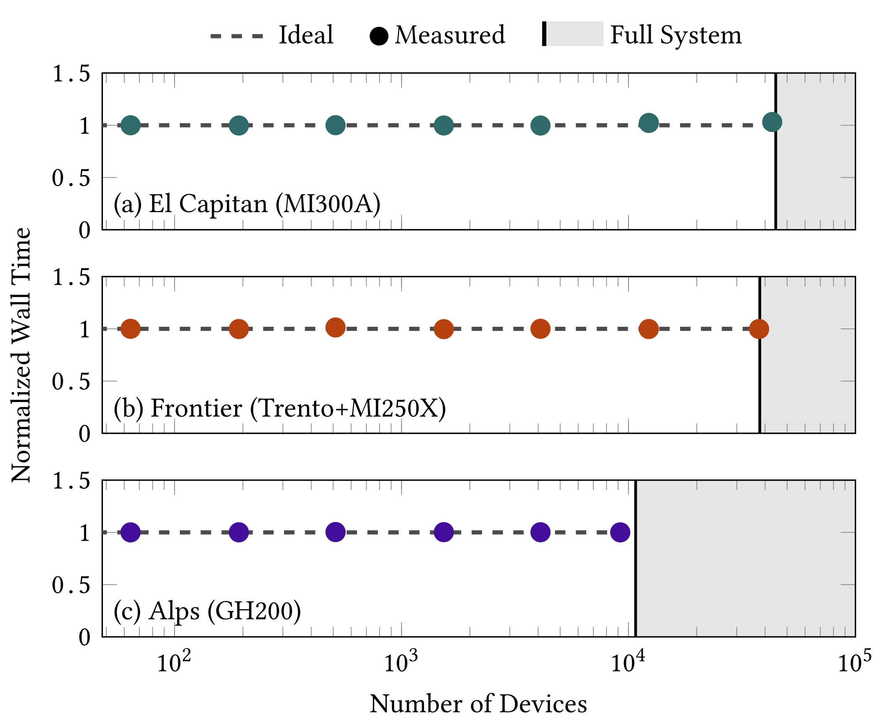

<p align="center">
  <a href="http://mflowcode.github.io/">
    
  </a>
</p>

<h3 align="center">An exascale many-physics flow solver</h3>

<p align="center">
  <a href="https://github.com/MFlowCode/MFC/actions">
    
  </a>
  <a href="https://github.com/MFlowCode/MFC/blob/master/.github/CONTRIBUTING.md">
    
  </a>
  <a href="https://join.slack.com/t/mflowcode/shared_invite/zt-y75wibvk-g~zztjknjYkK1hFgCuJxVw">
    
  </a>
  <a href="https://lbesson.mit-license.org/">
    
  </a>
  <a href="https://codecov.io/github/MFlowCode/MFC" target="_blank">
    
  </a>
  <a href="https://github.com/MFlowCode/MFC/blob/master/.github/CONTRIBUTING.md" target="_blank">
    
  </a>
</p>

<p align="center">
  <a href="https://mflowcode.github.io/">
    
  </a>
  <a href="https://github.com/codespaces/new?hide_repo_select=true&ref=master&repo=MFlowCode%2FMFC">
    
  </a>
  <a href="https://hub.docker.com/r/sbryngelson/mfc">
    
  </a>
  <a href="https://github.com/MFlowCode/homebrew-mfc">
    
  </a>
  <a href="https://www.youtube.com/@MFCode" target="_blank">
    
  </a>
</p>

> **2025 Gordon Bell Prize Finalist** - MFC simulates compressible multi-phase flows at exascale, using [Fypp](https://fypp.readthedocs.io/en/stable/fypp.html) metaprogramming in ~40K lines of Fortran. It conducted the [largest known public CFD simulation](https://arxiv.org/abs/2505.07392) at **200 trillion grid points** and 1 quadrillion degrees of freedom, scaling ideally to >43K AMD APUs on [El Capitan](https://hpc.llnl.gov/hardware/compute-platforms/el-capitan) and >33K AMD GPUs on [Frontier](https://www.olcf.ornl.gov/frontier/).

<div align="center">
  <video src="https://github.com/user-attachments/assets/4ad20dc2-0920-4ba0-9c95-0949768f8332" width="700" controls autoplay loop muted playsinline></video>
</div>

## Why MFC?

- **Exascale GPU performance** - Ideal weak scaling to 43K+ GPUs. Near compute-roofline behavior. [Compile-time case optimization](https://mflowcode.github.io/documentation/running.html) for up to 10x speedup.
- **Compact codebase** - ~40K lines of Fortran with [Fypp](https://fypp.readthedocs.io/en/stable/fypp.html) metaprogramming. Small enough to read and modify; powerful enough for [Gordon Bell](https://awards.acm.org/bell).
- **Native multi-phase** - 4, 5, and 6-equation models, phase change, surface tension, bubble dynamics, and Euler-Lagrange particle tracking, all built in.
- **Portable** - NVIDIA and AMD GPUs, CPUs, laptops to exascale. Docker, Codespaces, Homebrew, and [16+ HPC system templates](https://mflowcode.github.io/documentation/running.html).
- **Tested** - 500+ regression tests per PR with line-level [coverage](https://app.codecov.io/gh/MFlowCode/MFC) across GNU, Intel, Cray, and NVIDIA compilers.
- **Truly open** - MIT license, active [Slack](https://join.slack.com/t/mflowcode/shared_invite/zt-y75wibvk-g~zztjknjYkK1hFgCuJxVw), and responsive development team.

> If MFC is useful to your work, please ⭐ star the repo and [cite it](#citation)!

## Try MFC

| Path | Command |
| --- | --- |
| **Codespaces** (fastest) 💨 | [Open a Codespace](https://github.com/codespaces/new?hide_repo_select=true&ref=master&repo=MFlowCode%2FMFC) - pre-built, zero install |
| **Docker** 🐳 | `docker run -it --rm --entrypoint bash sbryngelson/mfc:latest-cpu` |
| **Homebrew** (macOS) 🍺 | `brew install mflowcode/mfc/mfc` |
| **From source** 💻 | `git clone https://github.com/MFlowCode/MFC && cd MFC && ./mfc.sh build -j $(nproc)` |

Your first simulation:
```bash
./mfc.sh run examples/3D_shockdroplet/case.py -n $(nproc)
```
Visualize the output in `examples/3D_shockdroplet/silo_hdf5/` with ParaView, VisIt, or your favorite tool.
For detailed build instructions (Linux, macOS, Windows/WSL, HPC clusters), see the [Getting Started guide](https://mflowcode.github.io/documentation/getting-started.html).

MFC is developed by the [Computational Physics Group at Georgia Tech](https://comp-physics.group) and collaborators.
Get in touch with <a href="mailto:shb@gatech.edu">Spencer</a> if you have questions!
We have an [active Slack channel](https://join.slack.com/t/mflowcode/shared_invite/zt-y75wibvk-g~zztjknjYkK1hFgCuJxVw) and development team.
MFC has high- and low-level documentation, visualizations, and more on [its website](https://mflowcode.github.io/).

## Examples

MFC ships with [137+ example cases](https://mflowcode.github.io/documentation/examples.html).
Here is a high-Mach flow over an airfoil (see [`examples/2D_ibm_airfoil/`](examples/2D_ibm_airfoil/)):

<p align="center">
    <br/>
</p>

And a high-amplitude acoustic wave reflecting and emerging through a circular orifice:

<p align="center">
    <br/>
</p>

## Toolchain

| Command | Description |
|---------|-------------|
| `./mfc.sh build` | Build MFC and its dependencies |
| `./mfc.sh run case.py` | Run a simulation case (interactive or batch: SLURM/PBS/LSF) |
| `./mfc.sh test` | Run the test suite |
| `./mfc.sh validate case.py` | Check a case file for errors before running |
| `./mfc.sh new my_case` | Create a new case from a template |
| `./mfc.sh clean` | Remove build artifacts |
| `./mfc.sh interactive` | Launch interactive menu-driven interface |

Run `./mfc.sh <command> --help` for detailed options, or see the [full documentation](https://mflowcode.github.io/documentation/index.html). Tab completion for bash and zsh is auto-installed after you have run `./mfc.sh generate` (or any non-`new` command) at least once. Play with the examples in `examples/` ([showcased here](https://mflowcode.github.io/documentation/examples.html)).

## Is this _really_ exascale?

MFC weak scales to the full machines on [El Capitan](https://hpc.llnl.gov/hardware/compute-platforms/el-capitan) (MI300A), [Frontier](https://www.olcf.ornl.gov/frontier/) (MI250X), and [Alps](https://www.cscs.ch/computers/alps) (GH200) with near-ideal efficiency.
MFC is a SPEChpc benchmark candidate, part of the JSC JUPITER Early Access Program, and used OLCF Frontier and LLNL El Capitan early access systems.

<p align="center">
    <picture>
        <source media="(prefers-color-scheme: dark)" srcset="docs/res/weakScaling/weakscaling-dark.png"/>
        <source media="(prefers-color-scheme: light)" srcset="docs/res/weakScaling/weakscaling.png"/>
        
    </picture>
</p>

## What else can this thing do?

### Physics

* 1-3D
* Compressible
	* Low Mach number treatment available
* Multi- and single-component
	* 4, 5, and 6 equation models for multi-component/phase features
   	* Kapila and Allaire models 5-equation models
* Multi- and single-phase
	* Phase change via p, pT, and pTg schemes
* Grids
	* 1-3D Cartesian, cylindrical, axisymmetric.
	* Arbitrary grid stretching for multiple domain regions.
	* Complex/arbitrary geometries via immersed boundary method
	* STL geometry files supported
* Surface tension for multiphase cases
* Sub-grid bubble dynamics
	* Euler-Euler volume-averaged bubble models
	* Euler-Lagrange particle tracking
	* Quadrature-based moment methods (QBMM)
* Viscous effects (high-order accurate representations)
* Hypoelastic and hyperelastic material models
* Ideal and stiffened gas equations of state
* Body forces
* Acoustic wave generation (one- and two-way sound sources)
* Chemistry and multi-species transport via [Pyrometheus](https://github.com/pyrometheus/pyrometheus)
* Magnetohydrodynamics (MHD)
* Relativistic Magnetohydrodynamics (RMHD)

### Numerics

* Shock and interface capturing schemes
	* First-order upwinding
 	* MUSCL (order 2)
  		* Slope limiters: minmod, monotonized central, Van Albada, Van Leer, superbee
 	* WENO reconstructions (orders 3, 5, and 7)
  	* WENO variants: WENO-JS, WENO-M, WENO-Z, TENO
   	* Monotonicity-preserving reconstructions
	* Reliable handling of large density ratios
* Exact and approximate (e.g., HLL, HLLC, HLLD) Riemann solvers
* Boundary conditions
	* Periodic, reflective, extrapolation/Neumann
	* Slip and no-slip
 	* Thompson-based characteristic BCs: non-reflecting sub/supersonic buffers, inflows, outflows
	* Generalized characteristic relaxation boundary conditions
* Runge-Kutta orders 1-3 (SSP TVD), adaptive time stepping
* RK4-5 operator splitting for Euler-Lagrange modeling
* Interface sharpening (THINC-like)
* Information geometric regularization (IGR)
    * Shock capturing without WENO and Riemann solvers

### Large-scale and accelerated simulation

* GPU compatible on NVIDIA ([P/V/A/H]100, GH200, etc.) and AMD (MI[1/2/3]00+) GPU and APU hardware
* Ideal weak scaling to 100% of the largest GPU and superchip supercomputers
    * \>43K AMD APUs (MI300A) on [LLNL El Capitan](https://hpc.llnl.gov/hardware/compute-platforms/el-capitan)
    * \>3K AMD APUs (MI300A) on [LLNL Tuolumne](https://hpc.llnl.gov/hardware/compute-platforms/tuolumne)
    * \>33K AMD GPUs (MI250X) on [OLCF Frontier](https://www.olcf.ornl.gov/frontier/)
    * \>10K NVIDIA GPUs (V100) on [OLCF Summit](https://www.olcf.ornl.gov/summit/)
* Near compute roofline behavior
* Compile-time case optimization (hard-codes parameters for significant speedup)
* RDMA (remote data memory access; GPU-GPU direct communication) via GPU-aware MPI on NVIDIA (CUDA-aware MPI) and AMD GPU systems
* Built-in profiling support (NVIDIA Nsight Compute/Systems, AMD rocprof)
* Optional single-precision computation and storage

### Software robustness and other features

* [Fypp](https://fypp.readthedocs.io/en/stable/fypp.html) metaprogramming for code readability, performance, and portability
* Continuous Integration (CI)
	* \>500 Regression tests with each PR.
 		* Performed with GNU (GCC), Intel (oneAPI), Cray (CCE), and NVIDIA (NVHPC) compilers on NVIDIA and AMD GPUs.
		* Line-level test coverage reports via [Codecov](https://app.codecov.io/gh/MFlowCode/MFC) and `gcov`
	* Benchmarking to avoid performance regressions and identify speed-ups
* Continuous Deployment (CD) of [website](https://mflowcode.github.io) and [API documentation](https://mflowcode.github.io/documentation/index.html)

## Citation

If you use MFC, consider citing it as below.
Ref. 1 includes all modern MFC features, including GPU acceleration and many new physics features.
If referencing MFC's (GPU) performance, consider citing ref. 1 and 2, which describe the solver and its design.
The original open-source release of MFC is ref. 3, which should be cited for provenance as appropriate.

<p align="center">
<a href="https://doi.org/10.1016/j.cpc.2026.110055" target="_blank">
    
</a>
<a href="https://doi.org/10.5281/zenodo.17049757" target="_blank">
    
</a>
<a href="https://github.com/MFlowCode/MFC/stargazers" target="_blank">
    
</a>
</p>

```bibtex
@article{wilfong26,
  Author = {Benjamin Wilfong and Henry {Le Berre} and Anand Radhakrishnan and Ansh Gupta and Daniel J. Vickers and Diego Vaca-Revelo and Dimitrios Adam and Haocheng Yu and Hyeoksu Lee and Jose Rodolfo Chreim and Mirelys {Carcana Barbosa} and Yanjun Zhang and Esteban Cisneros-Garibay and Aswin Gnanaskandan and Mauro {Rodriguez Jr.} and Reuben D. Budiardja and Stephen Abbott and Tim Colonius and Spencer H. Bryngelson},
  Title = {{MFC 5.0: A}n exascale many-physics flow solver},
  journal = {Computer Physics Communications},
  year = {2026},
  volume = {322},
  pages = {110055},
  doi = {10.1016/j.cpc.2026.110055},
}

@article{Radhakrishnan_2024,
  title   = {Method for portable, scalable, and performant {GPU}-accelerated simulation of multiphase compressible flow},
  author  = {A. Radhakrishnan and H. {Le Berre} and B. Wilfong and J.-S. Spratt and M. {Rodriguez Jr.} and T. Colonius and S. H. Bryngelson},
  journal = {Computer Physics Communications},
  year    = {2024},
  volume  = {302},
  pages   = {109238},
  doi     = {10.1016/j.cpc.2024.109238}
}

@article{Bryngelson_2021,
  title   = {{MFC: A}n open-source high-order multi-component, multi-phase, and multi-scale compressible flow solver},
  author  = {S. H. Bryngelson and K. Schmidmayer and V. Coralic and J. C. Meng and K. Maeda and T. Colonius},
  journal = {Computer Physics Communications},
  year    = {2021},
  volume  = {266},
  pages   = {107396},
  doi     = {10.1016/j.cpc.2020.107396}
}
```

## License

Copyright 2021 Spencer Bryngelson and Tim Colonius.
MFC is under the MIT license (see [LICENSE](LICENSE) for full text).

## Acknowledgements

Federal sponsors have supported MFC development, including the US Department of Defense (DOD), the National Institutes of Health (NIH), the Department of Energy (DOE) and National Nuclear Security Administration (NNSA), and the National Science Foundation (NSF).

MFC computations have used many supercomputing systems. A partial list is below
  * OLCF Frontier and Summit, and testbeds Wombat, Crusher, and Spock (allocation CFD154, PI Bryngelson).
  * LLNL El Capitan, Tuolumne, and Lassen; El Capitan early access system Tioga.
  * NCSA Delta and DeltaAI, PSC Bridges(1/2), SDSC Comet and Expanse, Purdue Anvil, TACC Stampede(1-3), and TAMU ACES via ACCESS-CI allocations from Bryngelson, Colonius, Rodriguez, and more.
  * DOD systems Blueback, Onyx, Carpenter, Nautilus, and Narwhal via the DOD HPCMP program.
  * Sandia National Labs systems Doom and Attaway, and testbed systems Weaver and Vortex.

---

<p align="center">
  <a href="https://star-history.com/#MFlowCode/MFC&Date">
    <picture>
      <source media="(prefers-color-scheme: dark)" srcset="https://api.star-history.com/svg?repos=MFlowCode/MFC&type=Date&theme=dark" />
      <source media="(prefers-color-scheme: light)" srcset="https://api.star-history.com/svg?repos=MFlowCode/MFC&type=Date" />
      
    </picture>
  </a>
</p>
