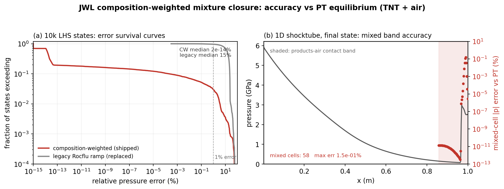

# 1D JWL Mixture-Closure Validation Benchmark

This benchmark quantifies the accuracy of the composition-weighted (CW) JWL
mixture closure (`src/common/m_jwl.fpp`) against a converged
pressure-temperature (PT) equilibrium reference, and against the legacy Rocflu
density/energy-ramp closure it replaced. It answers the question a reviewer of
the closure should ask: for the mixture states 0 < Y < 1 that the
five-equation solver actually produces, how far is the closed-form closure
from the rigorous two-phase equilibrium solution?

The CW closure is the default and currently only mixture model, and its
validated regime is JWL products with an ideal-gas ambient (this benchmark uses
TNT and air). The design leaves the port open for additional closures: every
EOS consumer routes through the three public wrappers in `m_jwl.fpp`
(`s_jwl_mix_state_er`, `s_jwl_mix_energy_pr`, `s_jwl_mix_sound_speed`), so a
second closure can be added at the single leaf routine without touching any
call site. The sanctioned next model is the N-constituent Mie-Grueneisen
pressure-equilibrium closure for the stiffened-ambient (underwater) and
high-density (products-water) regimes, where the CW closure is exact only at
the Y endpoints (see "Range of validity" and `README-JWL-IMPLEMENTATION.md`).
This benchmark scopes its PASS gates to the CW default's JWL-air regime, and
its PT-equilibrium reference is exactly what a future closure would be scored
against.



Left: over 10000 Latin-hypercube states the CW closure holds a machine-precision
median pressure error while the legacy Rocflu ramp it replaced sits near 15
percent. Right: in the 1D TNT-products/air shocktube, every mixed cell of the
final state tracks the PT-equilibrium pressure to better than 0.2 percent,
including the reflected-shock band recompressed to a few GPa. Regenerate with
`python3 plot_validation.py` after running `case.py`.

## The model under test

For a cell with JWL products mass fraction Y, the closure blends the JWL and
ambient laws with the heat-capacity share

    w = Y cv_prod / (Y cv_prod + (1 - Y) cv_amb),

giving effective coefficients An = w A, Bn = w B and a Grueneisen coefficient
that relaxes from the ambient Gamma to the products omega. Every coefficient
depends on Y alone, so the closure is exact at both endpoints, its
pressure-energy inverse is a single closed form, and its sound speed is the
exact analytic Grueneisen derivative. Physically, this closure is the exact
solution of the two-phase PT-equilibrium system in the limit of a vanishing
reference (cold) curve, which the JWL exponentials approach rapidly as the
products expand. Its error is therefore confined to strongly compressed
mixture states where the cold curve is live.

## The reference

The two-phase PT-equilibrium system (temperature equality, pressure equality,
volume additivity, energy conservation) reduces exactly to one scalar equation
in the products density: with both constituents Grueneisen-caloric, T is
explicit in rho_p, the ambient density follows from volume additivity, and
only pressure equality is nonlinear. `validate_closure.py` solves it with a
bracketed scan, bisection, and Newton polish, guarded by T > 0, and computes
the equilibrium sound speed by the implicit function theorem. The reference is
independent of the closure under test.

## Studies and measured results

Both studies run from `validate_closure.py` (numpy only) and exit nonzero on
any gate failure:

```console
./mfc.sh run benchmarks/1D_jwl_mixture_closure_validation/case.py -n 2
python3 benchmarks/1D_jwl_mixture_closure_validation/validate_closure.py
```

### 1. State-space study (Latin-hypercube protocol)

10000 states with p log-uniform in [1e4, 1e8] Pa, T uniform in [300, 5000] K,
Y uniform in (0, 1), seed 12345, constructed on the PT-equilibrium manifold
(the protocol of R. Jackson's JWL EOS notes). TNT products with ideal air.
The pressure ceiling is held at P_max = 1e8 Pa: this is the equilibrium mixing
range the closure is a baseline for, not the compressed CJ regime (TNT reaches
about 21 GPa at the front, two hundred times this ceiling). The compressed
regime is captured instead by the in-simulation study below, whose reflected
band recompresses the mixture to a few GPa. Raising P_max in the state-space
study extends the tail into that regime, which is where the CW baseline is
expected to leave residual error and where the Mie-Grueneisen enhancement is
aimed. Relative errors against the converged PT reference:

| closure | quantity | median | p95 | p99 | max |
| :--- | :--- | ---: | ---: | ---: | ---: |
| weighted-composition (shipped) | p | 1.6e-14 % | 1.2e-1 % | 3.5 % | 57 % |
| legacy Rocflu ramp (replaced) | p | 15 % | 24 % | 27 % | 62 % |
| weighted-composition (shipped) | T | 1.2e-14 % | 5.0e-3 % | 0.30 % | 23 % |
| legacy Rocflu ramp (replaced) | T | 6.8 % | 13 % | 14 % | 14 % |
| weighted-composition (shipped) | c | 1.4e-14 % | 3.6e-1 % | 4.8 % | 36 % |
| legacy Rocflu ramp (replaced) | c | 10 % | 16 % | 28 % | 58 % |

The shipped closure is at machine precision over the median state and over
more than 90 percent of the sampled space; its error tail is confined to
strongly compressed mixture states (bulk density approaching the products
reference density at intermediate Y). The legacy ramp carries a 7 to 15
percent error over the entire mixing band. The median pressure error improves
by 15 orders of magnitude. The analytic inverse round trip e to p to e closes
at 3.9e-16.

### 2. In-simulation study (this directory's case)

`case.py` is a 1D TNT-products/air shocktube (a 12 GPa products slug driving a
shock into ambient air) with a reflective right wall, so the final output
contains both the expanded mixture band behind the incident shock and the
recompressed band after wall reflection. `validate_closure.py --study
simulation` reads the final conserved fields, reconstructs (rho, e, Y) per
cell, and checks:

- Transcription fidelity: the script's closure pressure matches MFC's own
  output pressure to 2e-15, confirming the scored formula is the shipped one.
- Closure accuracy: every mixed cell is scored against the PT reference. On
  the pre-reflection flow of the open-tube variant of this case the mixed band
  sits at a maximum error of 1e-6 percent; the reflected-shock band probes the
  compressed regime and is gated at a 1 percent median and 10 percent p99.

## PASS gates

LHS study: shipped median |p| error at or below 1e-8 %, p95 at or below 1 %,
p99 at or below 10 %, inverse round trip at or below 1e-8, median improvement
over the legacy closure at least 1e6, valid-state fraction at least 95 %.
Simulation study: transcription fidelity at or below 1e-10, PT reference
convergence on at least 95 % of mixed cells, mixed-band median at or below
1 %, p99 at or below 10 %.

## Range of validity

This benchmark covers the CW baseline's design setting: JWL products with an
ideal-gas ambient, in the equilibrium mixing range. Two regimes are explicitly
outside the baseline and are under active enhancement:

- Stiffened ambient (underwater products-water). The reference cold curve of
  the liquid never vanishes, so no closed-form Y-only blend can track the
  equilibrium solution in the mixed band; the shipped closure is exact at the
  Y endpoints and heuristic between them.
- High-density and compressed mixture states (bulk density approaching the
  products reference density at intermediate Y, above the state-space study's
  P_max ceiling). This is where the CW baseline's error tail lives, as the
  reflected-shock band of the in-simulation study shows.

The rigorous N-constituent Mie-Grueneisen pressure-equilibrium closure is the
sanctioned enhancement for both regimes; it reintroduces the density and
energy dependence in the coefficients that the CW baseline drops, at the cost
of an iterative solve. It is not part of this PR (see
`README-JWL-IMPLEMENTATION.md`). The PT-equilibrium reference in
`validate_closure.py` is exactly the solution that enhancement would target, so
this benchmark already provides the golden reference to score it against when
it lands.

## References

- Garno, Ouellet, Bae, Jackson, Kim, Haftka, Hughes, Balachandar, Phys. Rev.
  Fluids 5, 123201 (2020): source of the legacy state-interpolated closure.
- R. Jackson, JWL EOS notes (2026): the LHS verification protocol and the
  classification of the composition-weighted closure as the exact limiting
  solution for a vanishing reference state.
- Lee, Hornig, Kury, UCRL-50422 (1968) and Dobratz & Crawford, UCRL-52997:
  JWL form and TNT parameters (via `toolchain/mfc/jwl_products.py`).
