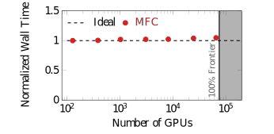
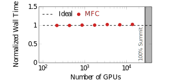
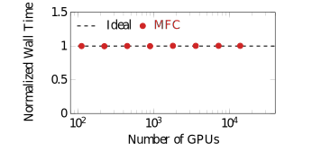
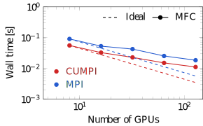
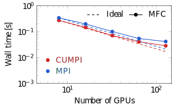
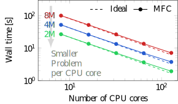

# Performance

MFC has been benchmarked on several CPUs and GPU devices.
This page is a summary of these results.

## Figure of merit: Grind time performance

The following table outlines observed performance as nanoseconds per grid point (ns/gp) per equation (eq) per right-hand side (rhs) evaluation (lower is better), also known as the grind time.
We solve an example 3D, inviscid, 5-equation model problem with two advected species (8 PDEs) and 8M grid points (158-cubed uniform grid).
The numerics are WENO5 finite volume reconstruction and HLLC approximate Riemann solver.
This case is located in `examples/3D_performance_test`.
You can run it via `./mfc.sh run -n <num_processors> -j $(nproc) ./examples/3D_performance_test/case.py -t pre_process simulation --case-optimization`, which will build an optimized version of the code for this case then execute it.
If the above does not work on your machine, see the rest of this documentation for other ways to use the `./mfc.sh run` command.

Results are for MFC v4.9.3 (July 2024 release), though numbers have not changed meaningfully since then.
Similar performance is also seen for other problem configurations, such as the Euler equations (4 PDEs).
All results are for the compiler that gave the best performance.
Note:
* CPU results may be performed on CPUs with more cores than reported in the table; we report results for the best performance given the full processor die by checking the performance for different core counts on that device. CPU results are the best performance we achieved using a single socket (or die).
These are reported as (X/Y cores), where X is the used cores, and Y is the total on the die.
* GPU results are for a single GPU device. For single-precision (SP) GPUs, we performed computation in double-precision via conversion in compiler/software; these numbers are _not_ for single-precision computation. AMD MI250X and MI300A GPUs have multiple graphics compute dies (GCDs) per device; we report results for one _GCD_*, though one can quickly estimate full device runtime by dividing the grind time number by the number of GCDs on the device (the MI250X has 2 GCDs). We gratefully acknowledge the permission of LLNL, HPE/Cray, and AMD for permission to release MI300A performance numbers.

| Hardware                  | Details                   | Type          | Usage           | Grind Time [ns]  | Compiler             | Computer     |
| ---:                      | ----:                     | ----:         | ----:           | ----:            | :---                 | :---         | 
| NVIDIA GH200              | GPU only                  | APU           | 1 GPU           | 0.32             | NVHPC 24.1           | GT Rogues Gallery  |
| NVIDIA H100               |                           | GPU           | 1 GPU           | 0.45             | NVHPC 24.5           | GT Rogues Gallery  |
| AMD MI300A                |                           | APU           | 1 _GCD_*        | 0.60             | CCE 18.0.0           | LLNL Tioga |
| NVIDIA A100               |                           | GPU           | 1 GPU           | 0.62             | NVHPC 22.11          | GT Phoenix  |
| NVIDIA V100               |                           | GPU           | 1 GPU           | 0.99             | NVHPC 22.11          | GT Phoenix  |
| NVIDIA A30                |                           | GPU           | 1 GPU           | 1.1              | NVHPC 24.1           | GT Rogues Gallery  |
| AMD MI250X                |                           | GPU           | 1 _GCD_*        | 1.1              | CCE 16.0.1           | OLCF Frontier |
| AMD MI100                 |                           | GPU           | 1 GPU           | 1.4              | CCE 16.0.1           | Cray internal system |
| NVIDIA L40S               | Single-precision GPU      | GPU           | 1 GPU           | 1.7              | NVHPC 24.5           | GT ICE  |
| AMD EPYC 9654             | Genoa                     | CPU           | 96/96 cores     | 1.7              | Intel oneAPI 2021.9  | DOD Carpenter  |
| NVIDIA P100               |                           | GPU           | 1 GPU           | 2.4              | NVHPC 23.5           | GT CSE Internal  |
| AMD EPYC 9534             | Genoa                     | CPU           | 64/64 cores     | 2.7              | GNU 12.3.0           | GT Phoenix  |
| NVIDIA A40                | Single-precision GPU      | GPU           | 1 GPU           | 3.3              | NVHPC 22.11          | NCSA Delta  |
| NVIDIA Grace CPU          | Arm, Neoverse V2          | CPU           | 72/72 cores     | 3.7              | NVHPC 24.1           | GT Rogues Gallery  |
| NVIDIA RTX6000            | Single-precision GPU      | GPU           | 1 GPU           | 3.9              | NVHPC 22.11          | GT Phoenix  |
| AMD EPYC 7763             | Milan                     | CPU           | 64/64 cores     | 4.1              | GNU 11.4.0           | NCSA Delta  |
| AMD EPYC 7713             | Milan                     | CPU           | 64/64 cores     | 5.0              | GNU 12.3.0           | GT Phoenix  |
| Intel Xeon 8480CL         | Sapphire Rapids           | CPU           | 56/56 cores     | 5.0              | NVHPC 24.5           | GT Phoenix  |
| Intel Xeon 6454S          | Sapphire Rapids           | CPU           | 32/32 cores     | 5.6              | NVHPC 24.5           | GT Rogues Gallery  |
| Intel Xeon 8462Y+         | Sapphire Rapids           | CPU           | 32/32 cores     | 6.2              | GNU 12.3.0           | GT ICE  |
| Intel Xeon 6548Y+         | Emerald Rapids            | CPU           | 32/32 cores     | 6.6              | Intel oneAPI 2021.9  | GT ICE  |
| Intel Xeon 8352Y          | Ice Lake                  | CPU           | 32/32 cores     | 6.6              | NVHPC 24.5           | GT Rogues Gallery  |
| Ampere Altra Q80-28       | Arm, Neoverse-N1          | CPU           | 80/80 cores     | 6.8              | GNU 12.2.0           | OLCF Wombat  | 
| AMD EPYC 7513             | Milan                     | CPU           | 32/32 cores     | 7.4              | GNU 12.3.0           | GT ICE  |
| AMD EPYC 7452             | Rome                      | CPU           | 32/32 cores     | 8.4              | GNU 12.3.0           | GT ICE  |
| IBM Power10               |                           | CPU           | 24/24 cores     | 10               | GNU 13.3.1           | GT Rogues Gallery |
| AMD EPYC 7401             | Naples                    | CPU           | 24/24 cores     | 10               | GNU 10.3.1           | LLNL Corona  |
| Apple M1 Pro              |                           | CPU           |  8/10 cores     | 14               | GNU 13.2.0           | N/A     |
| Intel Xeon 6226           | Cascade Lake              | CPU           | 12/12 cores     | 17               | GNU 12.3.0           | GT ICE  |
| Apple M1 Max              |                           | CPU           |  8/10 cores     | 18               | GNU 14.1.0           | N/A     |
| IBM Power9                |                           | CPU           | 20/21 cores     | 21               | GNU 9.1.0            | OLCF Summit |
| Intel Xeon E5-2650V4      | Broadwell                 | CPU           | 12/12 cores     | 27               | NVHPC 23.5           | GT CSE Internal  |
| Intel Xeon E7-4850V3      | Haswell                   | CPU           | 14/14 cores     | 34               | GNU 9.4.0            | GT CSE Internal  |

__All grind times are in nanoseconds (ns) per grid point (gp) per equation (eq) per right-hand side (rhs) evaluation, so X ns/gp/eq/rhs. Lower is better.__

## Weak scaling

Weak scaling results are obtained by increasing the problem size with the number of processes so that work per process remains constant.

### AMD MI250X GPU

MFC weask scales to (at least) 65,536 AMD MI250X GPUs on OLCF Frontier with 96% efficiency.
This corresponds to 87% of the entire machine.

### NVIDIA V100 GPU

MFC weak scales to (at least) 13,824 V100 NVIDIA V100 GPUs on OLCF Summit with 97% efficiency.
This corresponds to 50% of the entire machine.

### IBM Power9 CPU
MFC Weak scales to 13,824 Power9 CPU cores on OLCF Summit to within 1% of ideal scaling.

## Strong scaling

Strong scaling results are obtained by keeping the problem size constant and increasing the number of processes so that work per process decreases.

### NVIDIA V100 GPU

The base case utilizes 8 GPUs with one MPI process per GPU for these tests.
The performance is analyzed at two problem sizes: 16M and 64M grid points.
The "base case" uses 2M and 8M grid points per process.

#### 16M Grid Points

#### 64M Grid Points

### IBM Power9 CPU

CPU strong scaling tests are done with problem sizes of 16, 32, and 64M grid points, with the base case using 2, 4, and 8M cells per process.

