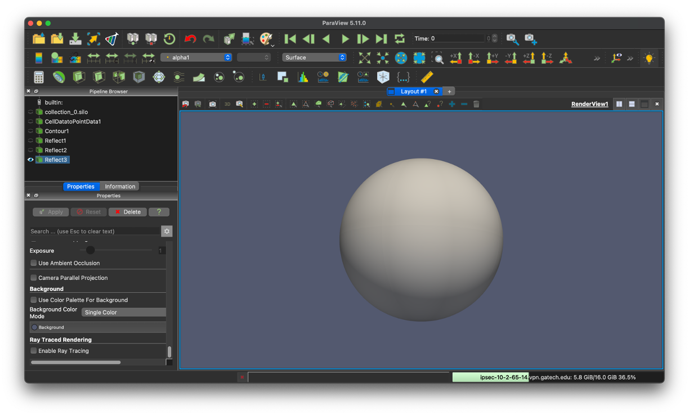

# Flow visualization

A post-processed database in Silo-HDF5 format can be visualized and analyzed using Paraview and VisIt.
After the post-processing of simulation data (see section [Running](running.md)), a directory named `silo_hdf5` contains a silo-HDF5 database.
Here, `silo_hdf5/` includes a directory named `root/` that contains index files for flow field data at each saved time step.

### Visualizing with Paraview

Paraview is an open-source interactive parallel visualization and graphical analysis tool for viewing scientific data.
Paraview 5.11.0 has been confirmed to work with the MFC databases for some parallel environments.
Nevertheless, the installation and configuration of Paraview can be environment-dependent and are left to the user.

The user can launch Paraview and open the index files under `/silo_hdf5/root`.
Once the database is loaded, flow field variables contained in the database can be added to the render view.
Further information on Paraview can be found in its [documentation](https://docs.paraview.org/en/latest/).
The figure below shows the iso-contour of the liquid void fraction (`alpha1`) in the database generated by the example case `3D_sphbubcollapse`.



### Visualizing data in cylindrical coordinates

Visualizing data in cylindrical coordinates requires a coordinate transformation of the raw data in the database file.
In Paraview, this coordinate transformation can be accomplished with the following steps:

1. Apply a `clean to grid` filter to the raw data

2. Apply a `calculator` filter to the cleaned data
    - Set the calculator `attribute type` to point data
    - Check the box for `Coordinate Results`
    - Enter the formula `coordsX*cos(coordsY)*iHat + coordsX*sin(coordsY)*jHat + coordsZ*kHat`
    - click apply

These steps will transform the raw data into cylindrical coordinates.
For many cases, this step will require resizing the render view window.

## Visualizing with VisIt

VisIt is an alternative open-source interactive parallel visualization and graphical analysis tool for viewing scientific data.
Versions of VisIt after 2.6.0 have been confirmed to work with the MFC databases for some parallel environments.
Nevertheless, installation and configuration of VisIt can be environment-dependent and are left to the user.
Further remarks on parallel flow visualization, analysis, and processing of the MFC database using VisIt can also be found in [Coralic (2015)](references.md) and [Meng (2016)](references.md).

The user can launch VisIt and open the index files under `/silo_hdf5/root`.
Once the database is loaded, flow field variables contained in the database can be added to the plot.
The figure below shows the iso-contour of the liquid void fraction (`alpha1`) in the database generated by the example case `3D_sphbubcollapse`.
For analysis and processing of the database using VisIt's capability, the user is encouraged to address [VisIt user manual](https://wci.llnl.gov/simulation/computer-codes/visit/manuals).


*Iso-contour of the liquid void fraction (`alpha1`) in the database generated by example case `3D_sphbubcollapse`*

## Serial data output

If ``parallel_io = 'F'``, MFC will output the conservative variables to a directory `D/`. 
If multiple cores are used ($\mathtt{ppn > 1}$), then a separate file is created for each core.
If only one coordinate dimension (`n = 0` and `p = 0`) exists, the primitive variables will also be written to `D/`.
The file names correspond to the variables associated with each equation solved by MFC.
They are written at every `t_step_save` time step.
The conservative variables are

$$ {(\rho \alpha)}\_{1}, \dots, (\rho\alpha)\_{N\_c}, \rho u\_{1}, \dots, \rho u\_{N\_d}, E, \alpha\_1, \dots, \alpha\_{N\_c} $$

and the primitive variables are

$$ {(\rho \alpha)}\_1, \dots, (\rho\alpha)\_{N\_c}, u\_1, \dots, u\_{N\_d}, p, \alpha\_1, \dots, \alpha\_{N\_c} $$

where $N_c$ are the number of components `num_fluids` and $N_d$ is the number of spatial dimensions. 
There are exceptions: if `model_eqns = 3`, then the six-equation model appends these variables with the internal energies of each component.
If there are sub-grid bubbles `bubbles = T`, then the bubble variables are also written. 
These depend on the bubble dynamics model used.
If ``polytropic = 'T'``, then the conservative variables are appended by 

$$ n\_b R\_1, n\_b {\\dot R}\_1, \dots, n\_b R\_{N\_b}, n\_b {\\dot R}\_{N\_b} $$

where $n_B$ is the bubble number density, and $N_b$ is the number of bubble sizes (see the matching variable in the input file, `Nb`).
The primitive bubble variables do not include $n_B$:

$$ R\_1, {\\dot R}\_1, \dots, R\_{N\_b}, {\\dot R}\_{N\_b} $$

## Remote Visualization on PACE Phoenix

### Step 1: Setting up your Environment

Begin by downloading the `.zip` file [here](https://www.dropbox.com/scl/fi/bdk8702oas8zqu0mk24vx/paceParaview.zip?rlkey=bov1s6lra0z7dhhrh6etniucx&st=2m9xvls4&dl=0).
This file contains two things:

- A bash script to automate the job submission process and provide instructions for remote connection
- A prebuilt Paraview 5.11 binary

Place the file `paceParview.zip` in your scratch direction on Phoenix and unzip it using `unzip paceParaview.zip`.
Enter the new directory `paceParaview` and run `tar -xvf ParaView-5.11.0-egl-MPI-Linux-Python3.9-x86_64.tar.gz` to decompress the compiled binary.
Now that you have the binary on Phoenix, you must download Paraview 5.11 on your local machine.
Paraview binaries can be downloaded [here](https://www.paraview.org/download/).
Select `v5.11` from the version drop-down bar and install a `5.11.0` version of Paraview.

### Step 2: Customizing the script

While all of the bash script's options could be passed as command-line arguments, hardcoding certain unlikely-to-change options saves time.
The following is a list of required and suggested updates to make to `pace-paraview-server`.

- (Optional) Update line 4 to customize the job name that will show up in the scheduler
- (Required) Update line 6 to point towards the location of your Paraview bin directory
- (Optional) Update line 51 to reflect the default account you'll use to run Paraview jobs
- (Optional) Update line 52 to reflect the default wall time requested for your job

### Step 3: Running pace-paraview-server

Before running `pace-paraview-server` for the first time, you must update its permissions by running `chmod u+x pace-paraview-server` in your command line.
Once this has been done, you can run `./pace-paraview-server` with the following options:

- `--account` specifies the charge account for the job.
If you updated line 51 of `pace-paraview-server` to reflect a default account, this option is optional; otherwise, it is required.
- `--nodes` specifies the number of nodes to request (default 1)
- `--mem` specifies the memory per node to request (default is to request all memory)
- `--gres` specifies the GPU resources to request.
These instructions have only been verified to work with `--gres gpu:V100:2`.
- `--time` specifies the time limit for your job.
This is optional and defaults to whatever is set on line 52 of `pace-paraview-server`.

Once you run `./pace-paraview-server <options>`, it'll take a bit to start up. 
In the meantime, you'll see the below message:

```shell
Submitted batch job <job #>
Waiting for ParaView server to start. This may take several minutes  ...
```

When initializing is done, you should see a dialogue with some recommended next steps, numbered 1-4. 
Below is a slightly altered version of that dialogue:

1) Create the appropriate port forwarding for your local ParaView session to connect with.
* On your local machine, run the following from a terminal: `nodeIdentifier` is the remote node running the ParaView server process (given in the output of the batch script), and `paceSystemIdentifier` is the name of the PACE system (however, this is configured with your `.ssh/config`).
* This terminal session must not be killed for your ParaView session as it maintains the port forwarding.
    * `ssh -L 8722:<nodeIdentifier>:53723 <paceSystemIdentifier>`

2) Once you have `Paraview5.11.0` on your machine, select `File -> Connect..` to open the remote connection dialogue box.
* Double-click the existing configuration if you've already set up the PACE connection.
* Click `Add Server` If you have not set up the PACE connection.
This will create a new dialogue box where you can specify a configuration name and set the `Port` to `8722`.
Once this is done, click `configure` and then `save` on the next dialogue box.
