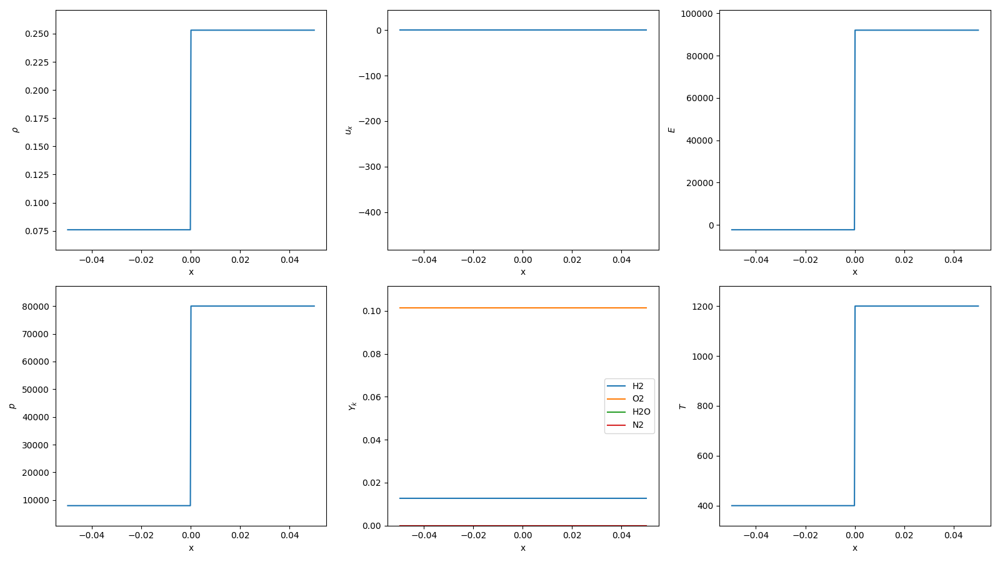
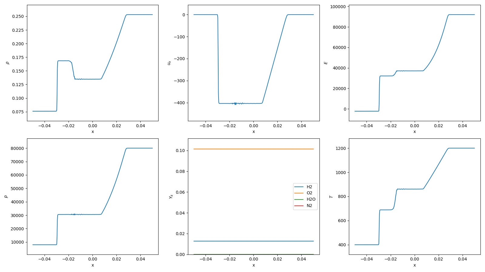

# 1D Multi-Component Inert Shock Tube

Reference: 
> P. J. Martínez Ferrer, R. Buttay, G. Lehnasch, and A. Mura, “A detailed verification procedure for compressible reactive multicomponent Navier–Stokes solvers”, Computers & Fluids, vol. 89, pp. 88–110, Jan. 2014. Accessed: Oct. 13, 2024. [Online]. Available: https://doi.org/10.1016/j.compfluid.2013.10.014

## Initial Condition

## Results

