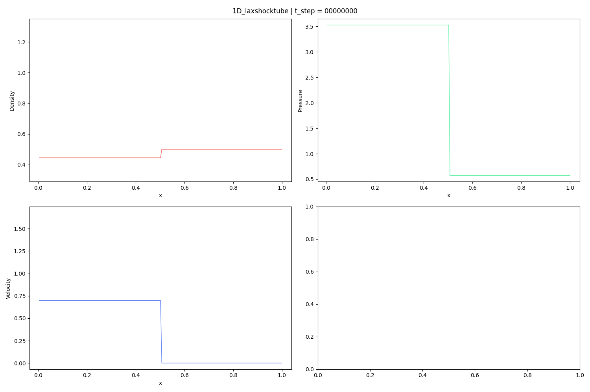
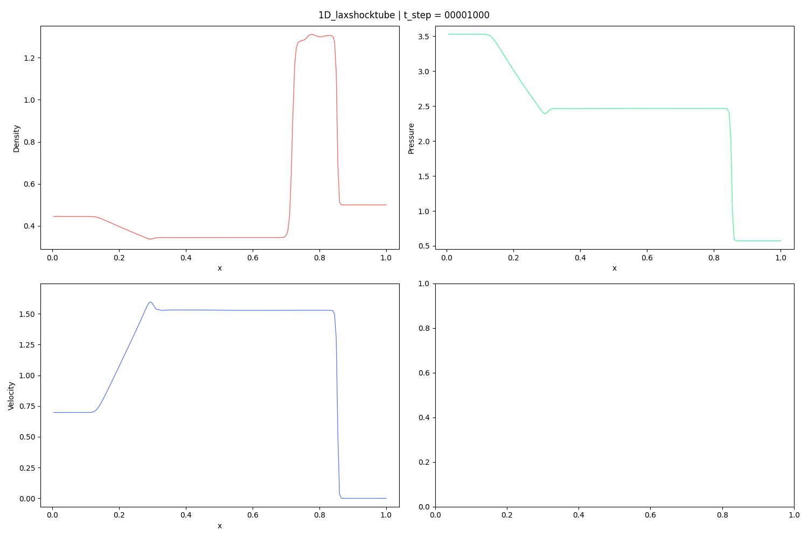

# Lax shock tube problem (1D)

Reference: 
> P. D. Lax, Weak solutions of nonlinear hyperbolic equations and their numerical computation, Communications on pure and applied mathematics 7 (1) (1954) 159–193.

## Initial Condition

## Result

