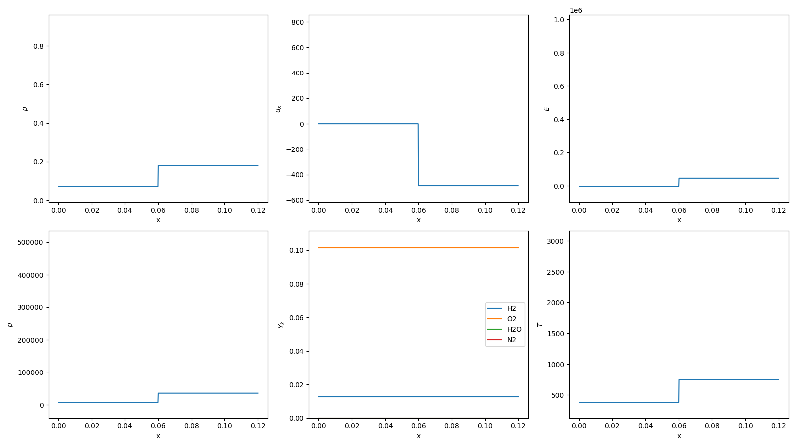
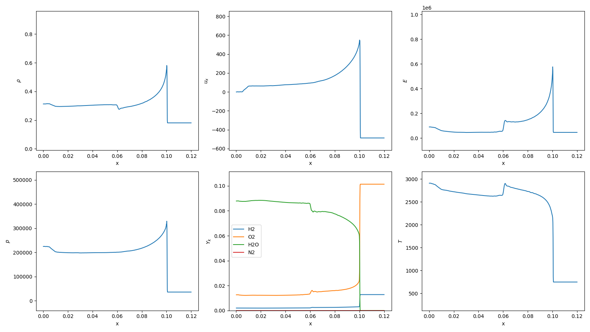

# 1D Multi-Component Reactive Shock Tube

References:
> P. J. Martínez Ferrer, R. Buttay, G. Lehnasch, and A. Mura, “A detailed verification procedure for compressible reactive multicomponent Navier–Stokes solvers”, Computers & Fluids, vol. 89, pp. 88–110, Jan. 2014. Accessed: Oct. 13, 2024. [Online]. Available: https://doi.org/10.1016/j.compfluid.2013.10.014

> H. Chen, C. Si, Y. Wu, H. Hu, and Y. Zhu, “Numerical investigation of the effect of equivalence ratio on the propagation characteristics and performance of rotating detonation engine”, Int. J. Hydrogen Energy, Mar. 2023. Accessed: Oct. 13, 2024. [Online]. Available: https://doi.org/10.1016/j.ijhydene.2023.03.190

## Initial Condition

## Results

