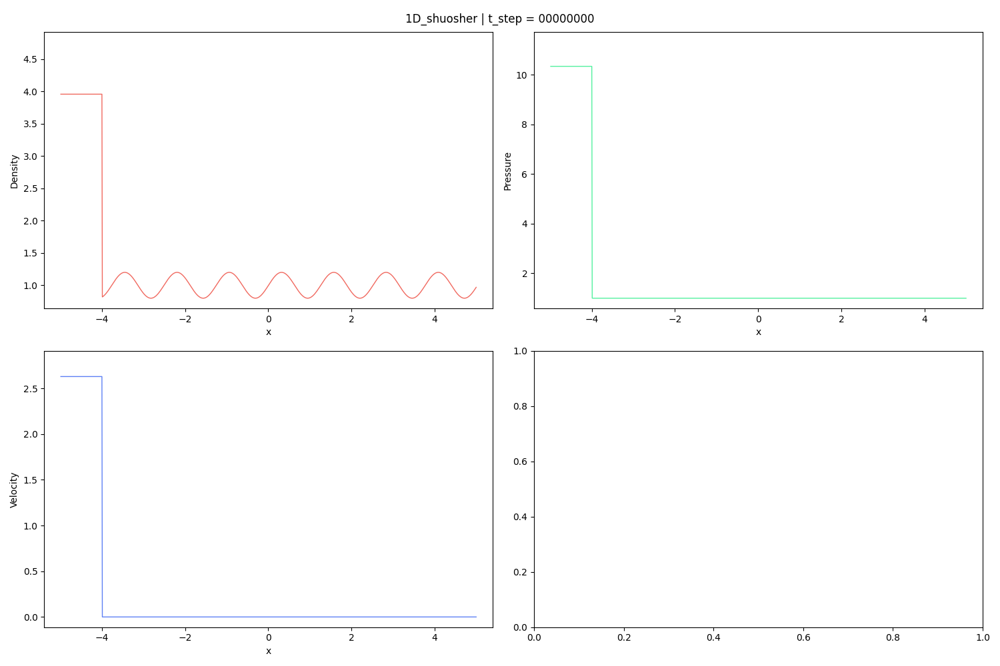
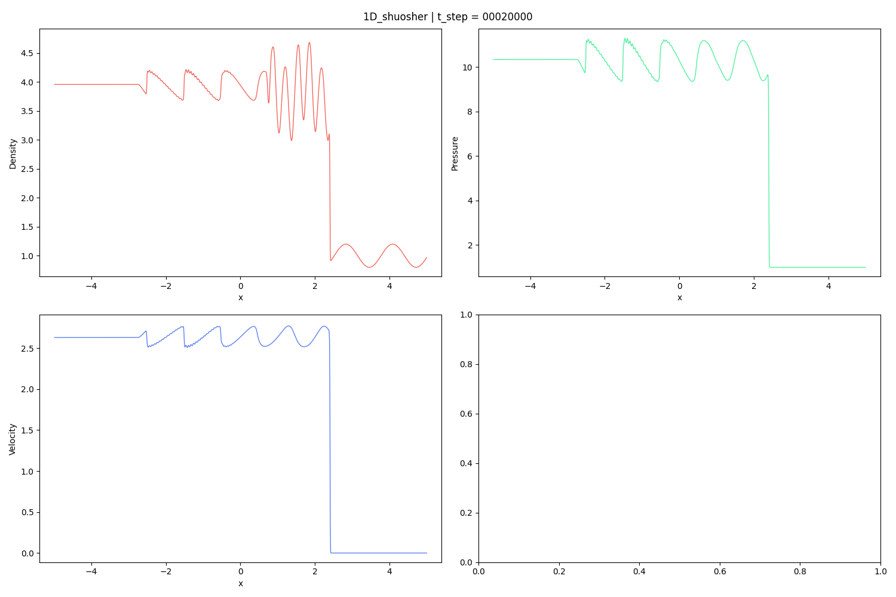

# Shu-Osher problem (1D)

Reference: C. W. Shu, S. Osher, Efficient implementation of essentially non-oscillatory shock-capturing schemes, Journal of Computational Physics 77 (2) (1988) 439–471. doi:10.1016/0021-9991(88)90177-5.

## Initial Condition

## Result

