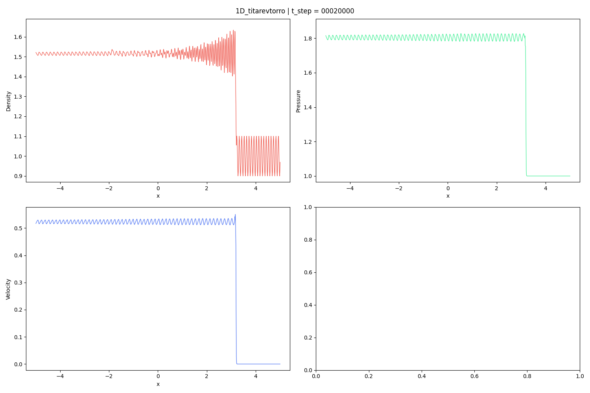

# Titarev-Toro problem (1D)

Reference: 
> V. A. Titarev, E. F. Toro, Finite-volume WENO schemes for three-dimensional conservation laws, Journal of Computational Physics 201 (1) (2004) 238–260.

## Initial Condition

## Result

