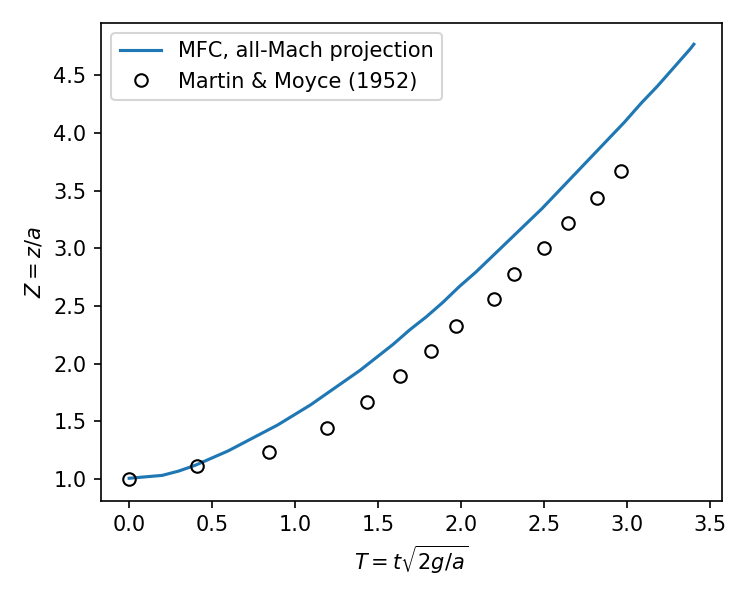

# Dam Break (2D, all-Mach pressure projection)

Collapse of a water column (a wide, 2a high, a = 2.25 in) in an air-filled 5a x 3a box with
free-slip walls, after Martin & Moyce (Phil. Trans. R. Soc. A 244:312-324, 1952), table 2
(n^2 = 2). Water and air carry their viscosities and surface tension, with MTHINC interface
compression (ic_beta = 1). The run ends at T = t*sqrt(2g/a) = 5 with adaptive time stepping;
the projection steps at a few hundred times the water acoustic limit.

```shell
./mfc.sh run examples/2D_dam_break/case.py -- --ppa 80
python3 examples/2D_dam_break/analyze.py examples/2D_dam_break --plot result.png
```

`--cfl` sets `cfl_target`, `--st-model` the surface tension model, and `--explicit` runs the
HLLC solver at the acoustic limit as a control.

## Surge front against the experiment (a/80)


The front leads the data by about 0.3a while matching its speed, as in other free-slip
simulations: the experiment's gate release was not instantaneous.
