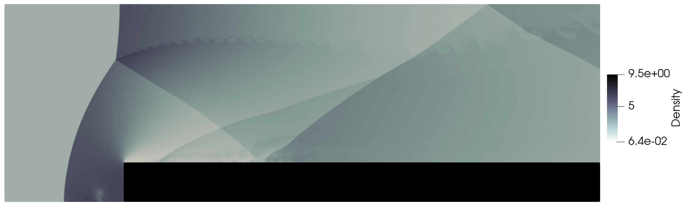

# Forward Facing Step (2D)

Reference:
> Woodward, P. *(1984). The numerical simulation of two-dimensional fluid flow with strong shocks. Journal of Computational Physics, 54(1), 115–173. https://doi.org/10.1016/0021-9991(84)90140-2*

## Final Condition (Density)

