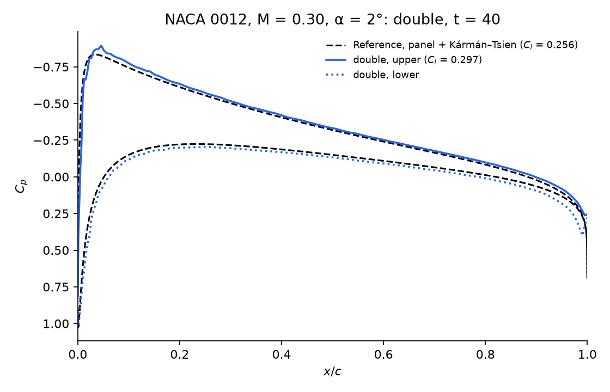

# Airfoil Surface Pressure

This test documents improvements made to the IBM airfoil patch.
A 2D inviscid NACA 0012 at M = 0.3 and α = 2° is modeled as a slip-wall immersed boundary with 200 cells per chord.
The surface pressure coefficient is compared to a vortex panel solution [1] corrected to M = 0.3 with the Kármán–Tsien rule [2, 3], using the NACA four-digit geometry [4].
The flow is inviscid, attached, and subcritical, so the reference gives $C_l = 0.256$ and $C_d = 0$.



To reproduce the figure, run the case and plot the last saved step:

```bash
./mfc.sh run examples/2D_ibm_airfoil_surface_pressure/case.py   # simulate to t = 40
./build/venv/bin/python3 examples/2D_ibm_airfoil_surface_pressure/plot_cp.py   # writes cp.png
```

### References

1. A. M. Kuethe and C.-Y. Chow, *Foundations of Aerodynamics: Bases of Aerodynamic Design*, 5th ed., Wiley, 1998. Sec. 5.10.
2. T. von Kármán, "Compressibility effects in aerodynamics," *Journal of the Aeronautical Sciences*, 8(9):337–356, 1941. doi:10.2514/8.10737
3. H. S. Tsien, "Two-dimensional subsonic flow of compressible fluids," *Journal of the Aeronautical Sciences*, 6(10):399–407, 1939. doi:10.2514/8.916
4. I. H. Abbott and A. E. von Doenhoff, *Theory of Wing Sections*, Dover, 1959. Ch. 6.
