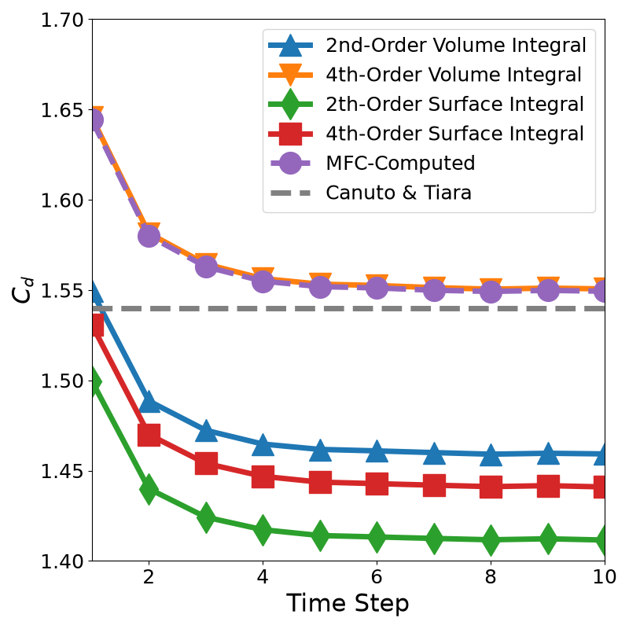

# 2D Viscous Drag Coefficient Convergence Test

## Case Set Up

This case file is an example of the convergence of the viscous drag over the surface of a 2D cylinder. We directly compare this result with the results of Canuto and Taira [1] which are the drag coefficient around a 2D culinder in low-mach viscous flows for varying Mach and Reynolds numbers. The case set up is the exact parameters used by Taira and Colonius [2] with the additional determination of the freestream pressure from the freestream Mach number. A full list of coefficient and flow parameters can be determined in Table 4 of [1]. This case matches their setup for `Re = 40` and `Ma = 0.1`.

## Numerics

Of particular note in getting the numerics of this case to match closely to those of Canuto and Taira, we used two techniques:

1. `"low_mach": 2` enables an improved WENO reconstruction scheme which reduces low-mach disipation from Thornbet et al. [3]

2. `"mp_weno": "F"` disables MPWENO from Dinshaw, Balsara, and Chi-Wang [4] which clamps the WENO flux terms in an attempt to correct in the case of sharp discontinuities. However, these low-Mach low-Renolds cases are very smooth. So the clipping is not needed, but any triggerings could reduce our numeric accuracy. This proved to be a significant improvement.

## Result

To test the required convergence, comparisons to 4 different pressure and viscous drag force integration methods was made: surface integration and volume integration both computed at 2nd and 4th order. These values were compared in a post-processing step. In this case file, we make use of `fd_order: 4`, which enabled 4th order finite differencing techniques to be used in the IB drag force volume integraiton method of MFC. The following plot demonstrates that the MFC calculation matches the post-processing impliementation of 4th-order, and that this technique gives the appropriate convergence.

The final MFC-obtained value of the drag coefficient is $C_{d}^{MFC} = 1.549$, which differs only slightly from the value from Canuto and Taira of $C_{d}^{Canuto} = 1.540$.

### References

[1] Canuto D, Taira K. Two-dimensional compressible viscous flow around a circular cylinder. Journal of Fluid Mechanics. 2015;785:349-371. doi:10.1017/jfm.2015.635

[2] Taira K, Colonius T. The immersed boundary method: A projection approach. Journal of Computational Physics. August 2007. doi:10.1016/j.jcp.2007.03.005

[3] B. Thornber, A. Mosedale, D. Drikakis, D. Youngs, R.J.R. Williams, An improved reconstruction method for compressible flows with low Mach number features. Journal of Computational Physics. Volume 227, Issue 10,2008, Pages 4873-4894. doi:10.1016/j.jcp.2008.01.036.

[4] Dinshaw S. Balsara, Chi-Wang Shu, Monotonicity Preserving Weighted Essentially Non-oscillatory Schemes with Increasingly High Order of Accuracy. Journal of Computational Physics. olume 160, Issue 2, 2000, Pages 405-452, doi:10.1006/jcph.2000.6443.