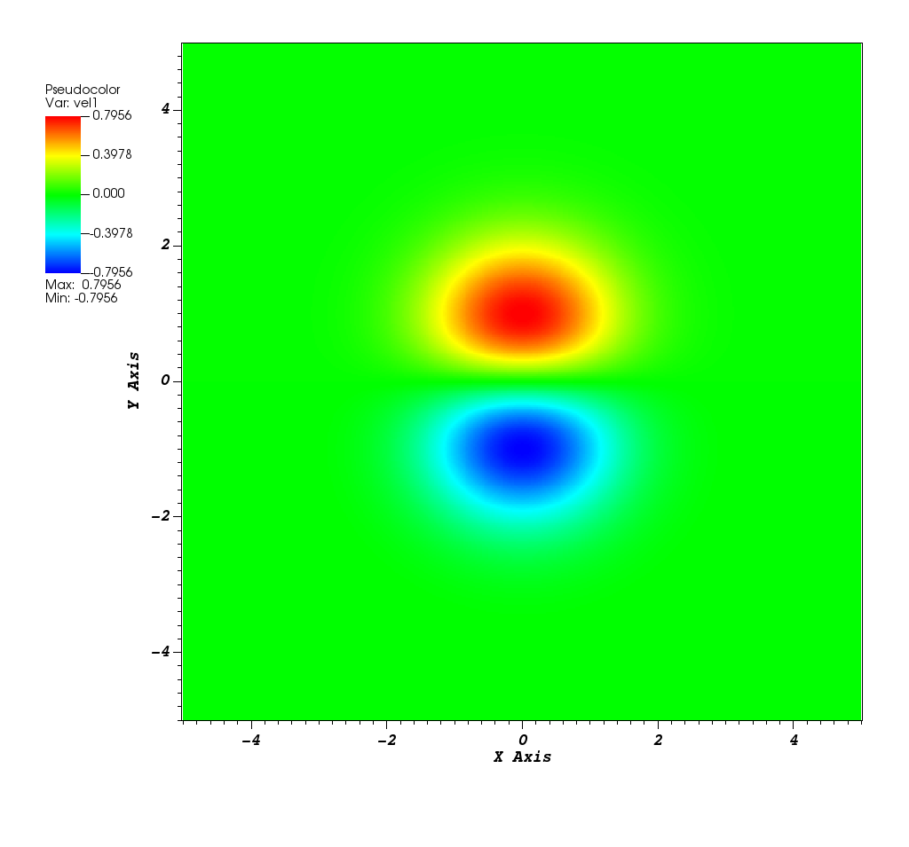
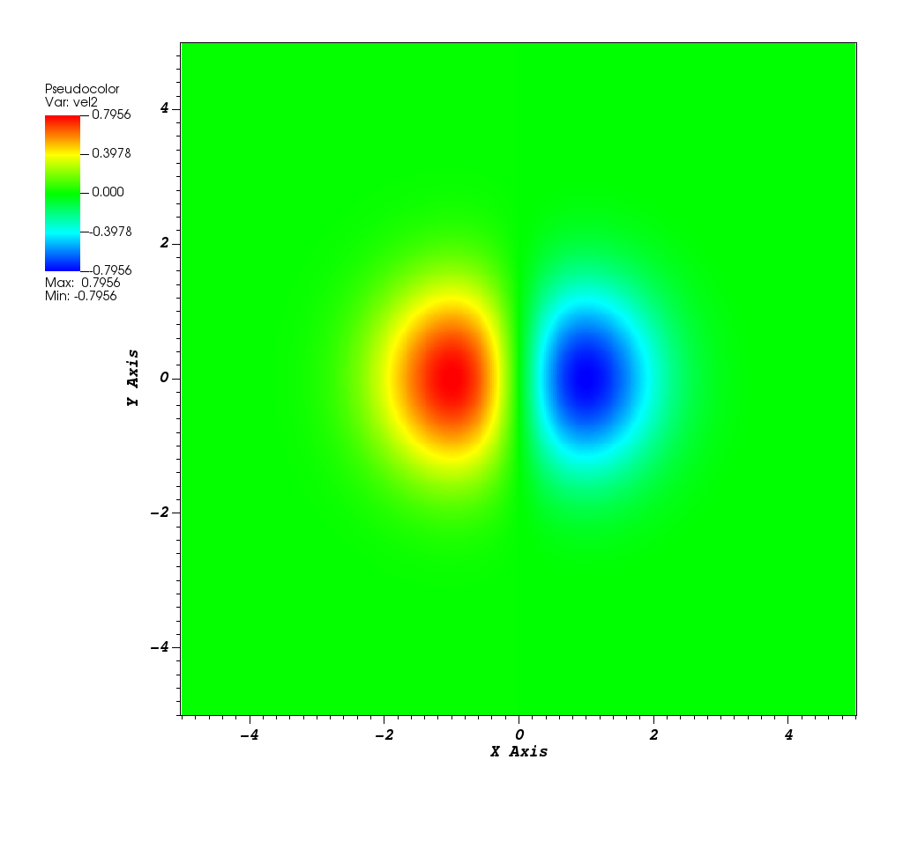

# Isentropic vortex problem (2D)

References:
* Coralic, V., & Colonius, T. (2014). Finite-volume Weno scheme for viscous compressible multicomponent flows. Journal of Computational Physics, 274, 95–121. https://doi.org/10.1016/j.jcp.2014.06.003
* Yee, H-C., Sandham, N. and Djomehri, M., (1999), "Low dissipative high order shock-capturing methods using characteristic-based filters", JCP, Vol. 150.

"Note that since the isentropic vortex is stationary, the exact solution at the given output time is simply the initial condition to the problem and any discrepancy
between the exact and numerical solutions is due to numerical diffusion." (Coralic and Colonius)

## Velocity (x)

## Velocity (y)

## Density

## Pressure

