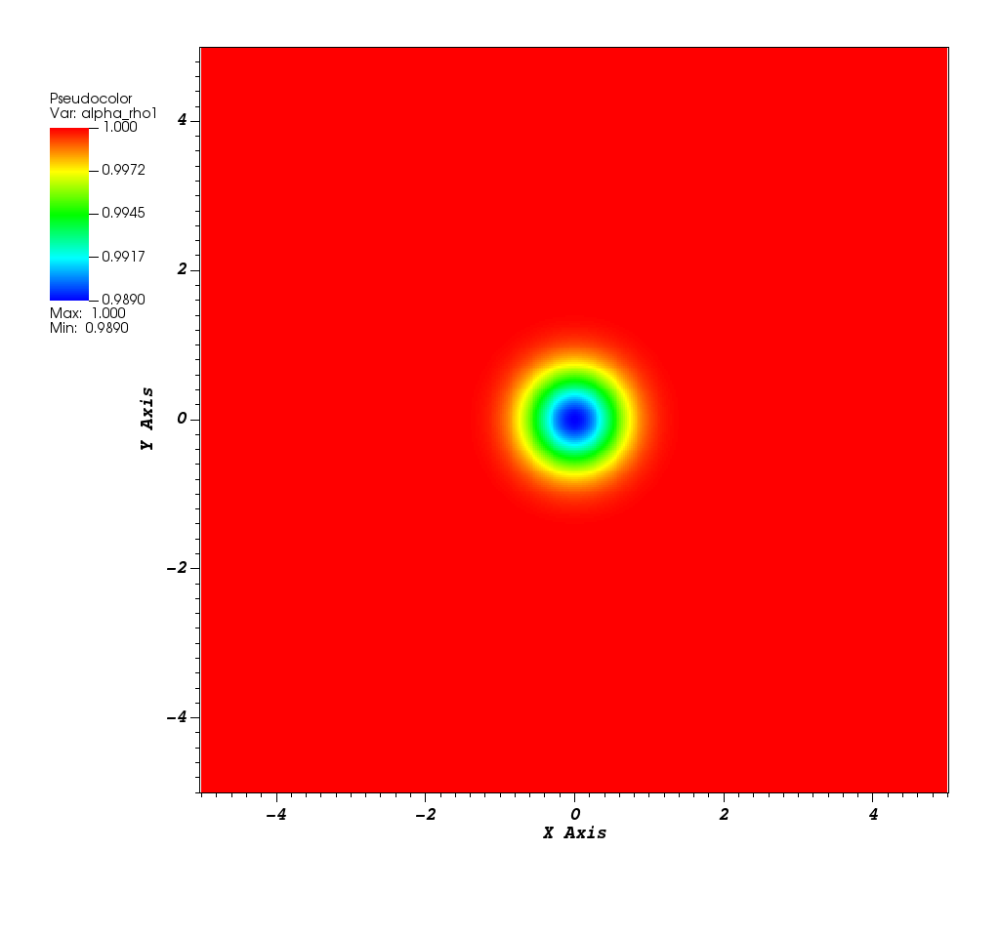
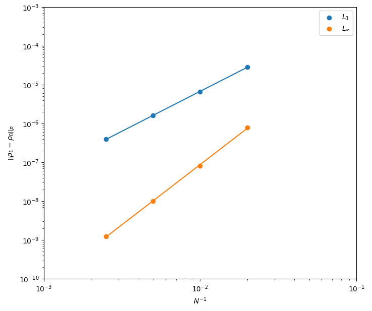

# Isentropic vortex problem (2D)

Reference: 
> Coralic, V., & Colonius, T. (2014). Finite-volume Weno scheme for viscous compressible multicomponent flows. Journal of Computational Physics, 274, 95–121. https://doi.org/10.1016/j.jcp.2014.06.003

## Density

## Density Norms

