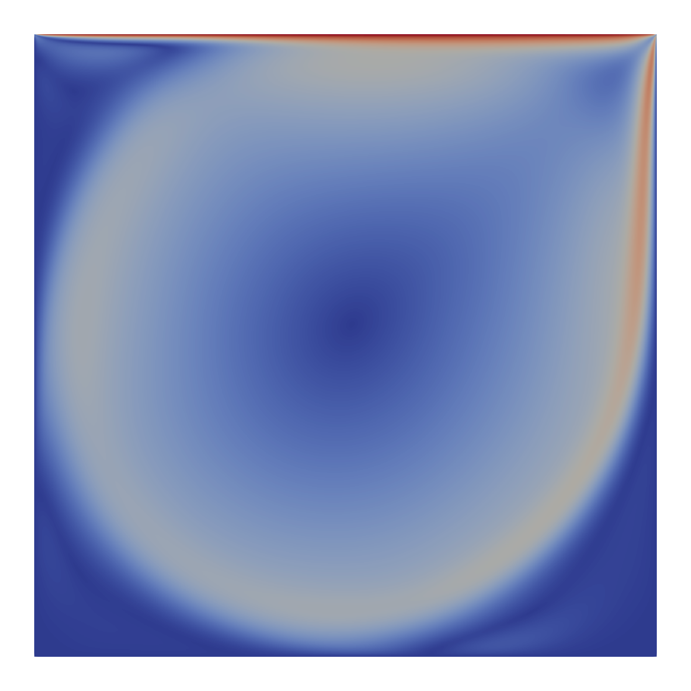

# Lid-Driven Cavity Problem (2D)

Reference: 
> Bezgin, D. A., & Buhendwa A. B., & Adams N. A. (2022). JAX-FLUIDS: A fully-differentiable high-order computational fluid dynamics solver for compressible two-phase flows. arXiv:2203.13760

> Ghia, U., & Ghia, K. N., & Shin, C. T. (1982). High-re solutions for incompressible flow
using the Navier-Stokes equations and a multigrid method. Journal of Computational Physics, 48, 387-411

## Final Condition

## Centerline Velocities

