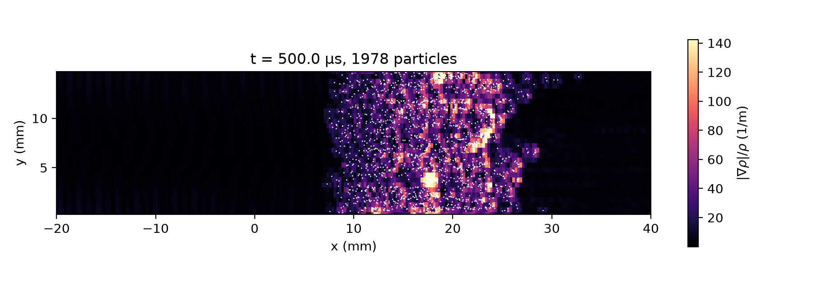

# 2D Shock–Particle Curtain Interaction

A Mach 1.66 planar shock, held by a Dirichlet inflow, hits a 2 mm thick curtain of glass particles (radius 57.5 µm, volume fraction 0.21) in 82.7 kPa air between slip walls. It uses the Euler-Lagrange solid-particle solver (`particles_lagrange`) with two-way coupling, Osnes quasi-steady drag, pressure-gradient force and added mass.

The setup follows the multiphase shock tube experiment of Wagner et al. (2012):
> J. L. Wagner, S. J. Beresh, S. P. Kearney, W. M. Trott, J. N. Castaneda, B. O. Pruett, and M. R. Baer, "A multiphase shock tube for shock wave interactions with dense particle fields", Experiments in Fluids, vol. 52, no. 6, pp. 1507–1517, 2012. https://doi.org/10.1007/s00348-012-1272-x

`gen_particles.py` writes the particles (seeded, uniform in the curtain band) to `input/particles.dat`; `case.py` calls it when pre_process runs, or run it yourself with `python3 gen_particles.py`. In 2D each particle stands for a slab of depth `charwidth`, so projected particles may overlap.

```shell
./mfc.sh run examples/2D_particle_curtain/case.py -n 4
```

## Result

Density-gradient schlieren |∇ρ|/ρ with the particles (white) at t = 500 µs.


