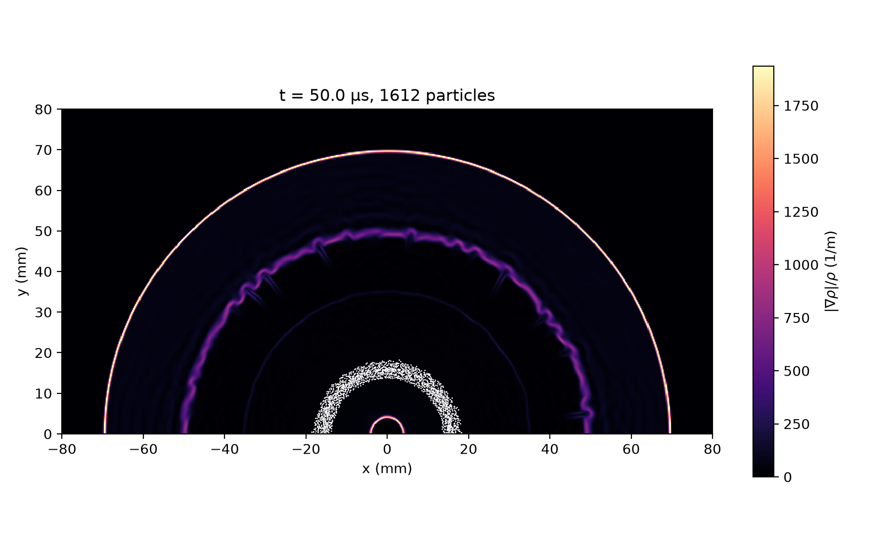

# 2D Blast Wave Through a Particle Half-Ring

A Mach 10 cylindrical blast wave, released from a high-pressure driver at the origin, hits a half-ring of 1612 magnesium particles (radius 50 µm) in air. It uses the Euler-Lagrange solid-particle solver (`particles_lagrange`) with two-way coupling, Osnes quasi-steady drag, pressure-gradient force and added mass.

`gen_particles.py` writes the particles (seeded random placement without overlaps, radius 11.05–12.65 mm) to `input/particles.dat`; `case.py` calls it when pre_process runs, or run it yourself with `python3 gen_particles.py`.

```shell
./mfc.sh run examples/2D_particle_hemisphere/case.py -n 4
```

## Result

Density-gradient schlieren |∇ρ|/ρ with the particles (white) at t = 50 µs.


