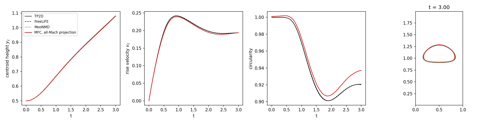

# Rising Bubble Benchmark (2D, all-Mach pressure projection)

The rising-bubble benchmark of Hysing et al. (International Journal for Numerical Methods in Fluids 60:1259-1288, 2009):
a bubble of diameter 0.5 rises under gravity in a 1 x 2 box with viscosity and surface tension.
Test case 1 (density ratio 10, viscosity ratio 10, Eo = 10) stays compact; test case 2 (density ratio
1000, viscosity ratio 100, Eo = 125) develops a skirt and thin trailing filaments. `reference/` holds
the benchmark's centroid, rise-velocity and circularity histories and final shapes from three groups.

```shell
./mfc.sh run examples/2D_rising_bubble/case.py -- --case 1 --ppl 80
python3 examples/2D_rising_bubble/analyze.py examples/2D_rising_bubble --case 1 --plot result.png
```

Both phases are stiffened gases with a water-like sound speed (1500), so the flow Mach number is
~2e-4. The projection steps at the flow's pace; `--explicit` runs the HLLC solver, which must
resolve the sound speed. At h = 1/40, test case 1 takes 1,660 projection steps (2.5 min on one A100)
against ~720,000 explicit steps (~2.4 h), about 58x in wall time.

## Test case 1, h = 1/80, against the reference


| quantity                | h = 1/40 | h = 1/80 | TP2D (finest) |
|-------------------------|----------|----------|---------------|
| min circularity         | 0.919    | 0.907    | 0.901         |
| max rise velocity       | 0.234    | 0.239    | 0.242         |
| centroid height, t = 3  | 1.073    | 1.079    | 1.081         |

Test case 2 converges toward the reference more slowly: from h = 1/40 to 1/80 the first rise-velocity
peak goes 0.240 -> 0.247 (TP2D 0.252) and the final centroid 1.071 -> 1.093 (TP2D 1.138), and the
circularity follows FreeLIFE and MooNMD. The second rise-velocity peak near t = 2 is not yet
reproduced at these resolutions, and the late rise velocity stays ~15% low.
