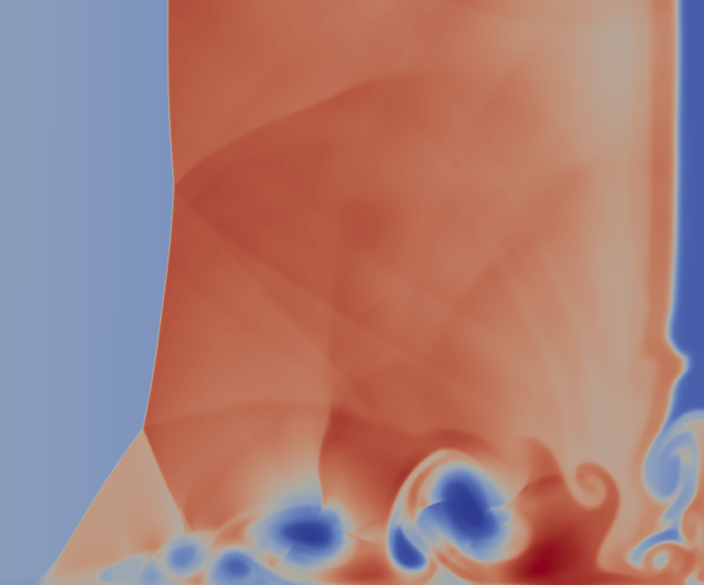

# Viscous Shock Tube (2D)

Reference: 
> A.S. Chamarthi, S.H. Frankel, A. Chintagunta, Implicit gradients based novel finite volume scheme for compressible single and multi-component flows, arXiv preprint arXiv:2106.01738 (2021)., see Example 4.13

**Key Parameters**

* $\gamma = 7/5$
* $Re = 1000$

**Initial Conditions**

* **Spatial Domain:** $(x, y) \in [0, 1] \times [0, 0.5]$

$$
(\rho, u, v, p) =
\begin{cases}
   (120, 0, 0, \frac{120}{\gamma}) & \text{if } 0 < x < 0.5 \\
   (1.2, 0, 0, \frac{1.2}{\gamma}) & \text{if } 0.5 \leq x < 1
\end{cases}
$$

### Initial State 

### Evolved State  

