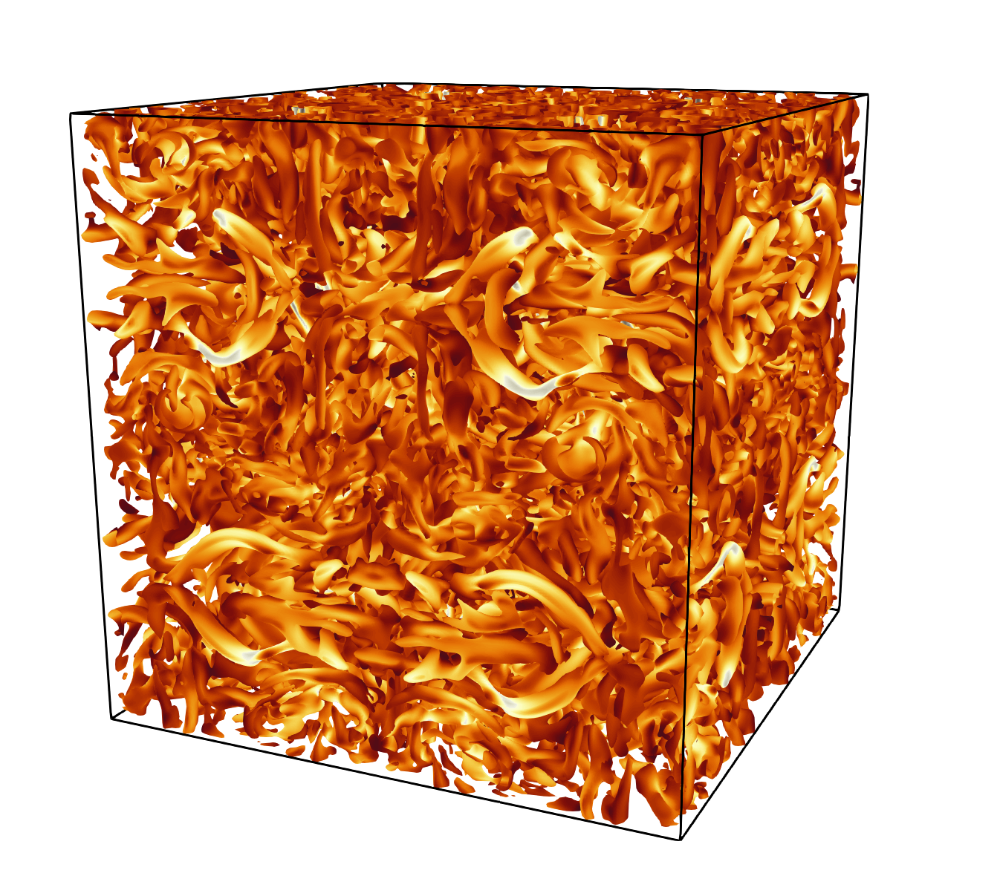

# Taylor-Green Vortex (3D)

Reference:
> Hillewaert, K. (2013). TestCase C3.5 - DNS of the transition of the Taylor-Green vortex, Re=1600 - Introduction and result summary. 2nd International Workshop on high-order methods for CFD.

## Final Condition
This figure shows the isosurface with zero q-criterion.

