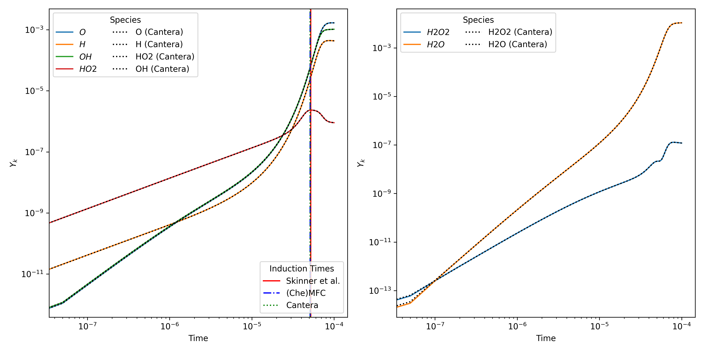

# Perfectly Stirred Reactor

Reference:
> G. B. Skinner and G. H. Ringrose, “Ignition Delays of a Hydrogen—Oxygen—Argon Mixture at Relatively Low Temperatures”, J. Chem. Phys., vol. 42, no. 6, pp. 2190–2192, Mar. 1965. Accessed: Oct. 13, 2024.

```bash
$ python3 analyze.py
Induction Times ([OH] >= 1e-6):
 + Skinner et al.: 5.200e-05 s
 + Cantera:        5.130e-05 s
 + (Che)MFC:       5.130e-05 s
```


